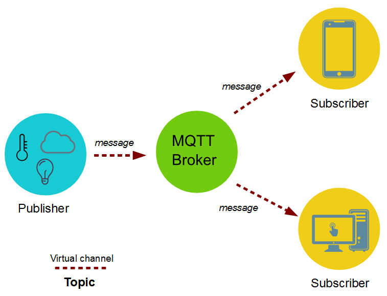
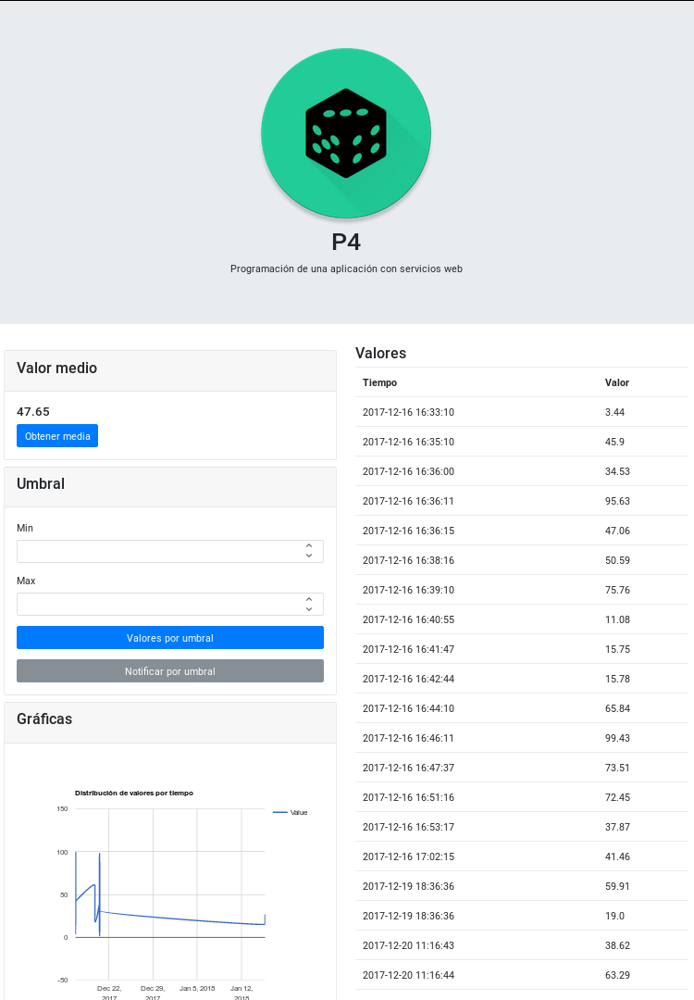
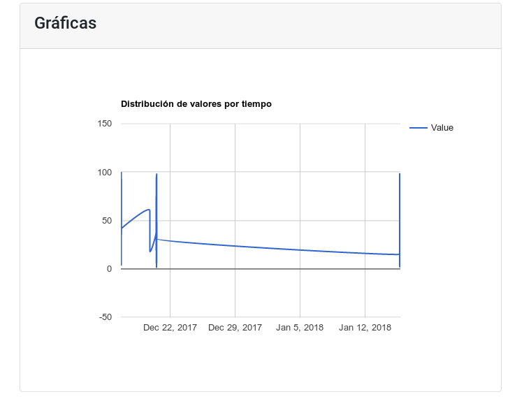
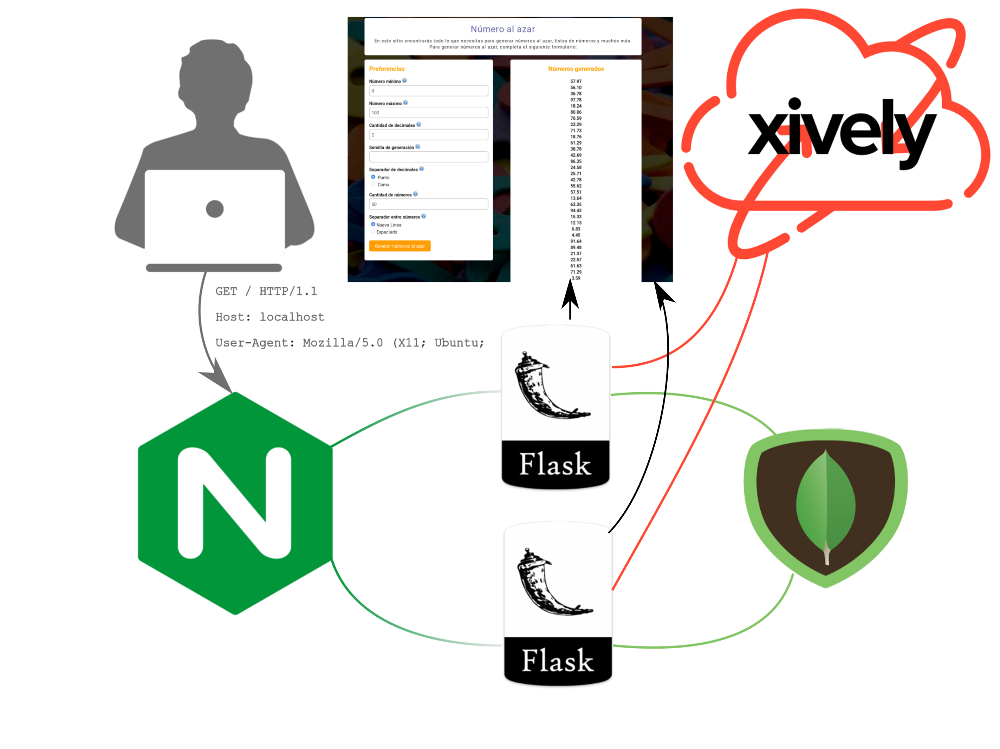

# PEC4: Aplicación con servicios web

## Especificación de la aplicación

Nuestra aplicación consistirá en un servidorque, mediante peticiones REST, ofrecerá al usuario la posibilidad de obtener números aleatorios (extraídos de otra página) especificando algunas condiciones. Para ello, desarrollaremos el código en python utilizando el framework Flask. Para el despliegue del sistema utilizaremos Docker y una arquitectura destinada a la alta disponibilidad y al balanceo de carga de las peticiones (no servirá para nada en un sistema que finalmente sólo utilizaremos nosotros, pero me parecía interesante para estudiarlo). A continuación pasaremos a detallarlo todo.

Para el control de versiones del software hemos utilizado GIT, utilizando como repositorio remoto [GitHub](https://github.com): [https://github.com/junquera/P4-TSR](https://github.com/junquera/P4-TSR)

### Obtención y filtrado de datos

Para la obtención de los datos, codificada en el archivo `src/app/obtain.py`, hemos utilizado la librería `requests`. Descargamos la página `http://www.numeroalazar.com.ar/` y mediante una expresión regular, obtenemos el primer valor de la lista.

``` python
# Extracción de datos
re.search(r'<div[\s]+(?=class="[^"]+"[\s]+id="numeros_generados"|id="numeros_generados"[\s]+class="[^"]+")[^>]*>.+?<h2>[^\<]+<\/h2>(.+?)<\/div>', content, flags=re.MULTILINE|re.DOTALL)
```

En la primera implementación utilicé la librería `xml`:

``` python
import xml.etree.ElementTree as ET
root = ET.fromstring(content)
v = root.find(//div[@id='numeros_generados']//h2)
```

Posteriormente probé con la librería `BeautifulSoup`, destinada al parsing de documentos XML, pero para ajustarme a los requisitos del enunciado, terminé implementando la expresión regular.

> TODO CRON DE OBTENCIÓN DE DATOS

He programado, utilizando decorators de python, una función cron (en el archivo `cron.py`) que se encarga de descargar los valores cada 2 minutos.

```python
cron = Cron()
@cron.add_task(minute=2, fast_boot=True)
def save_value():
    db.add_value(get_a_value())
```

Podría haber utilizado el cron del sistema, pero la distribución que utilicé para el primer docker (aunque ahora usa *Ubuntu* porque necesitaba algunas librerías de criptografía para la conexión con Xively, al principio utilizaba *alpine linux*) era muy ligera y no lo tenía integrado, así que decidí hacerlo yo.

### Almacenamiento

La lógica para el manejo del almacenamiento de los datos está codificada en el archivo `almacenamiento.py`. He creado una clase para la base de datos local, otra para la base de datos online y, por último, una clase que actúa de interfaz para que al leer los datos se acceda sólo a la local y al insertarlos se haga en las dos. He decidido utilizar la base de datos local como base de datos principal (porque así trabajaremos con ella más rápido) y la de la nube como backup. Al instanciarse la clase `Almacenamiento`, se borran los datos de la base de datos local y se descargan los de la nube.

#### Almacenamiento local

Para el almacenamiento de los datos en local he utilizado una base de datos MongoDB. Es una base de datos NoSQL simple y rápida, con la que se interactúa a través de mensajes en formato JSON. Nos es muy útil por la facilidad de generar estos mensajes en python.

En ambos casos, la estructura del *documento* almacenado es la siguiente:

``` python
{
  "value": valor_aleatorio,
  "date": fecha_en_formato_ISO
}
```

#### Almacenamiento en la nube

Para la nube, he utilizado la plataforma [Xively](https://www.xively.com/). Es más compleja que otras propuestas, pero quería probar a utilizar el protocolo MQTT, muy utilizado últimamente para IoT (de hecho, Xively está pensado como plataforma en la nube para dispositivos del Internet de las Cosas).

Para la subida de datos utilizamos el protocolo MQTT. En este protocolo los clientes se conectan (en MQTT diremos que se suscriben) a una lista manejada por un *broker* (en este caso, Xively). Dicho broker se encarga de entregar los mensajes que produzca un publicador a los clientes suscritos. Nuestra conexión se hará de forma cifrada, y está codificada en el archivo `xively.py`, y la subida corresponde con el método `publish_random_value_mqtt`.



En este esquema, nuestra aplicación haría tanto la función de publicador como la de suscriptor, aunque la obtención de datos la haremos de otra forma.

Para la descarga de los datos (codificada en `retrieve_random_values_http`)  utilizaremos la API REST de Xively. La autenticación se realiza mediante un token JWT (JSON Web Tokens) obtenido al iniciar sesión, y que iremos renovando cada 25 minutos:

``` python
  payload = {
                "emailAddress" : xiv_data['login_username'],
                "password" : xiv_data['login_password'],
                "accountId": xiv_data['account_id'],
                "renewalType": "short"
            }

  response = requests.request("POST", login_url, data=payload)

  if response.status_code == 200:
      self.jwt = json.loads(response.text)['jwt']
```

Todos los valores de autenticación se encuentran en el archivo `config.py`, aunque por seguridad no están incluidos en nuestro repositorio GIT, y simplemente hemos subido la plantilla (`config_template.py`).

El uso de Xively, como comentaba anteriormente, ha hecho todo mucho más complicado de lo que habría podido ser: requería de aprender un protocolo nuevo, estudiar toda su documentación para la autenticación, el manejo de librerías poco comunes... Pero nos ha permitido ver distintas formas de comunicación entre servicios web y mostrar claramente cómo, a través de nuestra API REST, realmente estamos abstrayendo un servicio muy complejo.

### Presentación de la web

La web se presenta como un panel en el que se muestran los números aleatorios que hemos recopilado y una serie de cajas con opciones. Está programado en HTML y he utilizado la librería `bootstrap.css` para que sea responsive y se pueda ver bien en cualquier dispositivo. He utilizado el motor de renderizado de Flask `jinja2` para mostrar en la plantilla los datos generados por la aplicación. Las opciones con las que trabajaremos serán:

- Obtención del valor medio

- Obtención de datos por umbral

- Gráfica con histórico de obtención de los datos



A continuación pasaremos a detallar cómo funciona cada una de ellas.

### Umbral histórico - Petición del usuario (dato 1)

Para el umbral histórico el usuario introducirá los datos en el cuadro titulado **Umbral**. Puede introducir un valor mínimo, un valor máximo o ambos. Esta petición se codifica como un mensaje HTTP POST con los campos `min` y `max`, codificado en `app.py`:

``` python
    ...

elif request.method == 'POST':

    max_threshold = None
    min_threshold = None

    if 'max_threshold' in request.form:
        try:
            max_threshold = float(request.form['max_threshold'])
        except:
            pass

    ...
```

### Umbral histórico - Respuesta de la aplicación al usuario (dato 1)

Mostraremos en el panel de la derecha dos columnas mostrando los datos que han sido inferiores o que han superado dicho umbral. Para ello, buscaremos en nuestra base de datos dichos valores:

``` python
# almacenamiento.py

def get_by_threshold(self, **kwargs):
    result = {}
    if 'min' in kwargs:
        if not kwargs['min'] is None:
            try:
                min = float(kwargs['min'])
                min_vs = self.random_values.find({
                    'value': {'$lt':  min}
                })
                result['min'] = [value for value in min_vs]
            except:
                pass
    if 'max' in kwargs:
      ...
```

Y posteriormente los mostramos en nuestra plantilla a través de una tabla (codificada, como hemos dicho, con Jinja2):

```html

<h4>Valores</h4>
<table class="table table-stripped">
  <thead>
    <th scope="col">Tiempo</th>
    <th scope="col">Valor</th>
  </thead>
  <tbody>
    
      <tr><td>{{ value.date | datetime }}</td><td>{{ value.value }}</td></tr>
    
  </tbody>
</table>

```

### Valor medio - Petición del usuario y respuesta de la aplicación (dato 2)

Para la petición de valor medio, en lugar de un POST, he decidido utilizar la petición GET e indicarle a la aplicación que queremos la media con una query url. Si detecta que la url tiene al final un `?avg`, quiere decir que el cliente nos está pidiendo la media, y la calculamos sobre los valores que vamos a mostrar en la tabla principal.

```python
# app.py

if request.method == 'GET':
    values = db.get_all()
    if 'avg' in request.args: # http://localhost/?avg
      ...
```

### Interfaz gráfica de usuario de las plataformas externas (dato 3)

Como Xively no ofrece ningún servicio de gráficas externas, he decidido implementar yo una utilizando la librería javascript [Google Charts](https://developers.google.com/chart/). Como los valores que devuelve nuestra aplicación llevan una marca de tiempo, creo una tabla que mostrará cuándo hemos ido obteniendo cada uno de ellos.

```html
<!-- templates/index.html -->

<script type="text/javascript">
 google.charts.load('current', {'packages':['line', 'corechart']});
 google.charts.setOnLoadCallback(drawChart);

 function drawChart() {

  var data = new google.visualization.DataTable();
  data.addColumn('datetime', 'Date');
  data.addColumn('number', 'Value');
  data.addRows([
    
      [
        new Date(Date.parse("{{ value.date | datetime }}")),
        {{ value.value }}
      ],
    
  ]);

   var options = {
     title: 'Distribución de valores por tiempo',
     curveType: 'function'
   };

   var chart = new google.visualization.LineChart(document.getElementById('chart_div'));

   chart.draw(data, options);
 }
 window.onresize = drawChart;
</script>
```



Como podemos ver en la figura, mostramos qué valor entre 0 y 100 ha sido obtenido del generador de números aleatorios y cuándo ha sido obtenido. La distribución sería uniforme si el servicio estuviese levantado constantemente, pero así al menos podemos apreciar que nuestro backup en la nube sigue funcionando.

## Especificación avanzada

Además de los puntos requeridos en el enunciado he decidido que la especificación avanzada sea aplicar técnicas para que el despliegue del servicio sea lo más parecido posible al despliegue de un Web Service real de producción.

Ya hemos comentado cómo funciona el sistema del login (`jwt` en lugar de `0auth`), y a continuación explicaremos cómo hemos hecho que el servicio de petición de umbral sea asíncrono y qué medidas hemos aplicado para hacer un despliegue en producción de nuestro sistema.

### Desarrollo de umbral actual (respondiendo por SSE o *web pusher*)

`TODO`

- SSE: http://flask.pocoo.org/snippets/116/

- Web Pusher: https://sendpulse.com/

### Gunicorn

Para levantar nuestra app a modo de servicio en producción he utilizado [*gunicorn*](http://gunicorn.org/). *Gunicorn* es una librería de python destinada a manejar servidores WSGI HTTP de manera que el desarrollador no se tenga que preocupar por el número de hilos destinados al proceso, el manejo de los logs...

Para utilizarla he añadido la librería a mi gestor de dependencias (he utilizado `Pipenv`) y he creado el archivo `wsgi.py` que contiene todo lo necesario para que *gunicorn* pueda levantar el servidor en el puerto `8000`.

## Nginx

Como el puerto `80` es un puerto reservado por el sistema operativo y podríamos querer tener más de un servicio web corriendo en nuestra máquina, levantamos la aplicación en el puerto `8000` y utilizamos [*Nginx*](https://nginx.org/en/) como proxy de las peticiones. Lo he configurado para que, además de manejar las peticiones en el puerto `80` y redirigirlas a nuestra aplicación, actúe como balanceador de carga entre dos instancias de la aplicación (que veremos más adelante en la sección de docker).

De esta forma, además de poder tener varios servicios web en la máquina, podríamos utilizar la máquina como **middleware** para que redirigiese las peticiones a otros servidores distribuidos en caso de que tuviésemos muchos clientes. La configuración de *nginx* se encuentra en el archivo `nginx.conf`.

### Docker

Para orquestar los distintos servicios de nuestro sistema con [Docker](https://www.docker.com/) (*nginx*, *mongodb*, la propia aplicación...) he utilizado *docker-compose*. He creado dos archivos *Dockerfile* y los pongo en común a través de `docker-compose.yml`.

- Dockerfile-app

Es el archivo de configuración del Docker de nuestra aplicación. En él instalo *python* (he utilizado *python3*) y las dependencias necesarias para que funcione.

- Dockerfile-nginx

En él se instala *nginx* e indico que utilice el archivo de configuración que he escrito para nuestro sistema.

- docker-compose.yml

Aquí es donde configuro la arquitectura completa. Para la base de datos, he utilizado la imagen que ofrece *mongodb* para docker, e indico que exponga el puerto `27017` para que los demás componentes se puedan conectar a ella. Como quiero simular un sistema distribuido, levanto dos instancias de la aplicación a las que llamaremos `app1` y `app2`, indicando que se conecten a la base de datos pasando como variable de entorno su *hostname* (docker se encarga de enrutar la conexión hasta el equipo que hemos llamado `db`). Aquí es donde realmente aprovechamos la potencia de *Docker*: sólo hemos configurado un *Dockerfile* para nuestro servicio y lo levantamos todas las veces que queramos.

Finalmente, levanto *nginx*, configuro que las dos instancias de nuestra aplicación tendrán como *hostname* `app1` y `app2`; y marco que exponga al exterior el puerto `80` (asociándolo al puerto `80` del propio contenedor de *Docker*) para que nos podamos conectar.

La arquitectura de nuestro sistema quedaría así:



## GIT


## Bibliografía

- https://statusq.org/archives/2014/10/25/6161/

- https://www.coria.com/blog/xively/xivelyonpython-step2
- https://junquera.app.xively.com/devices/84740985-263b-4777-a44a-53710e34de82
- https://developer.xively.com/docs/device-authentication-methods
- https://developer.xively.com/

- https://www.digitalocean.com/community/tutorials/how-to-set-up-django-with-postgres-nginx-and-gunicorn-on-ubuntu-16-04
- https://www.digitalocean.com/community/tutorials/how-to-set-up-nginx-server-blocks-virtual-hosts-on-ubuntu-16-04
- http://vladikk.com/2013/09/12/serving-flask-with-nginx-on-ubuntu/
